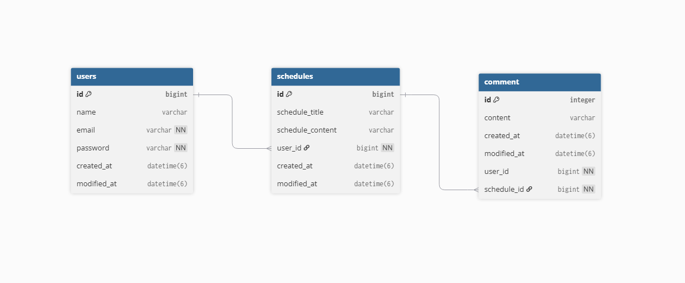

# API 명세서 설계

- 자원(Resource): 일정(schedules), 유저(users), 댓글(comments)
        
- 행동(Method):

        POST   /register               → 회원 가입
        POST   /login                  → 로그인
        POST   /logout                 → 로그아웃

        GET    /users                  → 유저 전체 조회
        GET    /users/{userId}         → 특정 유저 조회
        PUT    /users/{userId}         → 유저 수정
        DELETE /users/{userId}         → 유저 삭제

        POST   /schedules              → 일정 추가
        GET    /schedules              → 일정 전체 조회
        GET    /schedules/page         → 일정 전체 페이지 조회
        GET    /schedules/{scheduleId} → 특정 일정 조회
        PUT    /schedules/{scheduleId} → 일정 수정
        DELETE /schedules/{scheduleId} → 일정 삭제

        POST   /comments               → 댓글 추가
        GET    /comments               → 댓글 전체 조회
        GET    /comments/{commentId}   → 특정 댓글 조회
        PUT    /comments/{commentId}   → 댓글 수정
        DELETE /comments/{commentId}   → 댓글 삭제

- 응답(Response): JSON 형식으로 설계

```jsx
{
    "name": "이름", 
    "email": "이메일@이메일.com", 
    "password": "비밀번호는8글자"
}
```

# API 명세서

## 유저(User) 명세서

### 유저 등록(회원가입, 로그인, 로그아웃)
- Request - 요청
- Method: POST
- URL: {{http://localhost:8080}}/register
- Content-Type: application/json
- Body:

```jsx
{
    "name": "이름",
    "email": "이메일@이메일.com",
    "password": "비밀번호는8글자"
}
```

Response
- Status Code: 201 Created
- Body:

```jsx
{
    "id": "AutoIncrement(Integer)",
    "name": "{{$body 'name' ''}}",
    "email": "{{$body 'email' ''}}",
    "createdAt": {{$isoTimestamp}},
    "modifiedAt": {{$isoTimestamp}}
}
```
- Request - 요청
- Method: POST
- URL: {{http://localhost:8080}}/login
- Content-Type: application/json
- Body:

```jsx
{
    "email": "이메일@이메일.com",
    "password": "비밀번호는8글자"
}
```

Response
- Status Code: 200 OK
- Body:

```jsx
{
    "id": "AutoIncrement(Integer)",
    "name": "{{$body 'name' ''}}",
    "email": "{{$body 'email' ''}}"
}
```

- Request - 요청
- Method: POST
- URL: {{http://localhost:8080}}/logout
- Content-Type: application/json

Response
- Status Code: 204 No Content

### 전체 조회
- Request - 요청
- Method: GET
- URL: {{http://localhost:8080}}/users
  Response
- Status Code: 200 OK
- Body:

```jsx
[
  {
    "id": "AutoIncrement(Integer)",
    "name": "{{$body 'name' ''}}",
    "email": "{{$body 'email' ''}}",
    "createdAt": {{$isoTimestamp}},
    "modifiedAt": {{$isoTimestamp}}
  }
]
```

### 특정 유저 조회
- Request - 요청
- Method: GET
- URL: {{http://localhost:8080}}/users/{id}
- Path Parameters:
  키 : id / 값 : 1
- Response
- Status Code: 200 OK
- Body:

```jsx
{
    "id": "AutoIncrement(Integer)", 
    "name": "{{$body 'name' ''}}", 
    "email": "{{$body 'email' ''}}",
    "createdAt": {{$isoTimestamp}},
    "modifiedAt": {{$isoTimestamp}}
}

```

### 유저 수정
- Request - 요청
- Method: PUT
- URL: {{http://localhost:8080}}/users/{id}
- Path Parameters:
  키 : id / 값 : 1
- Content-Type: application/json
- Body:

```jsx
{
    "name": "작성자명",
    "password": "비밀번호"
}
```

Response

- Status Code: 200 OK
- Body:

```jsx
{
    "id": "AutoIncrement(Integer)",
    "title": "{{$body 'title' ''}}",
    "name": "{{$body 'name' ''}}",
    "modifiedAt": {{$isoTimestamp}}
}
```

### 유저 삭제
- Request - 요청
- Method: DELETE
- URL: {{http://localhost:8080}}/users/{id}
- Path Parameters:
  키 : id / 값 : 1

Response
- Status Code: 204 No Content

## 일정(Schedule) 명세서

### 일정 등록
- Request - 요청
- Method: POST
- URL: {{http://localhost:8080}}/schedules
- Content-Type: application/json
- Body:

```jsx
{
    "scheduleTitle": "일정 제목",
    "scheduleContent": "일정 내용",
    "userId": 1
}
```

Response
- Status Code: 201 Created
- Body:

```jsx
{
    "id": "AutoIncrement(Integer)",
    "scheduleTitle": "{{$body 'title' ''}}",
    "scheduleContent": "{{$body 'contents' ''}}",
    "userId": "userId",
    "createdAt": {{$isoTimestamp}}
    "modifiedAt": {{$isoTimestamp}}
}
```

### 전체 조회
- Request - 요청
- Method: GET
- URL: {{http://localhost:8080}}/schedules
  Response
- Status Code: 200 OK
- Body:

```jsx
[
  {
    "id": "AutoIncrement(Integer)",
    "scheduleTitle": "{{$body 'title' ''}}",
    "scheduleContent": "{{$body 'contents' ''}}",
    "modifiedAt": {{$isoTimestamp}}
  }
]
```
### 일정 페이지 조회
- Request - 요청
- Method: GET
- URL: {{http://localhost:8080}}/schedules/page
- Response
- Status Code: 200 OK
- Body:

```jsx
{
    "content": [
        {
            "id": "AutoIncrement(Integer)",
            "scheduleTitle": "{{$body 'title' ''}}",
            "scheduleContent": "{{$body 'contents' ''}}",
            "commentAmount": "amount",
            "createdAt": {{$isoTimestamp}},
            "modifiedAt": {{$isoTimestamp}},
            "userName": "{{$bodt 'name' ''}}"
        }
    ],
    "empty": false,
    "first": true,
    "last": true,
    "number": 0,
    "numberOfElements": 1,
    "pageable": {
        "offset": 0,
        "pageNumber": 0,
        "pageSize": 10,
        "paged": true,
        "sort": {
            "empty": true,
            "sorted": false,
            "unsorted": true
        },
        "unpaged": false
    },
    "size": 10,
    "sort": {
        "empty": true,
        "sorted": false,
        "unsorted": true
    },
    "totalElements": 1,
    "totalPages": 1
}

```

### 특정 일정 조회
- Request - 요청
- Method: GET
- URL: {{http://localhost:8080}}/schedules/{id}
- Path Parameters:
  키 : id / 값 : 1
- Response
- Status Code: 200 OK
- Body:

```jsx
{
    "id": "AutoIncrement(Integer)",
    "scheduleTitle": "{{$body 'title' ''}}",
    "scheduleContent": "{{$body 'contents' ''}}",
    "modifiedAt": {{$isoTimestamp}},
    "comments": [
      {
        "id": "AutoIncrement(Integer)",
        "content": "{{$body 'contents' ''}}",
        "createdAt": {{$isoTimestamp}},
        "modifiedAt": {{$isoTimestamp}},
        "userId": "userId"
        "scheduleId": "scheduleId"
      }
   ]
}
```


### 일정 수정
- Request - 요청
- Method: PUT
- URL: {{http://localhost:8080}}/schedules/{id}
- Path Parameters:
  키 : id / 값 : 1
- Content-Type: application/json
- Body:

```jsx
{
    "scheduleTitle" : "일정 제목 수정",
    "scheduleContent" : "일정 내용 수정"
}
```

Response

- Status Code: 200 OK
- Body:

```jsx
{
    "id": "AutoIncrement(Integer)",
    "scheduleTitle": "{{$body 'title' ''}}",
    "scheduleContent": "{{$body 'content' ''}}",
    "modifiedAt": {{$isoTimestamp}}
}
```


### 일정 삭제
- Request - 요청
- Method: DELETE
- URL: {{http://localhost:8080}}/schedules/{id}
- Path Parameters:
  키 : id / 값 : 1

Response
- Status Code: 204 No Content

## 댓글(Comment) 명세서

### 댓글 등록
- Request - 요청
- Method: POST
- URL: {{http://localhost:8080}}/comments
- Content-Type: application/json
- Body:

```jsx
{
    "contents": "댓글 내용",
    "userId": 1,
    "scheduleId": 1

}
```

Response
- Status Code: 201 Created
- Body:

```jsx
{
    "id": "AutoIncrement(Integer)",
    "content": "{{$body 'contents' ''}}",
    "createdAt": {{$isoTimestamp}},
    "modifiedAt": {{$isoTimestamp}},
    "userId": "userId",
    "scheduleId": "scheduleId"
}
```

### 전체 조회
- Request - 요청
- Method: GET
- URL: {{http://localhost:8080}}/comments
  Response
- Status Code: 200 OK
- Body:

```jsx
[
  {
    "id": "AutoIncrement(Integer)",
    "content": "{{$body 'content' ''}}",
    "createdAt": {{$isoTimestamp}},
    "modifiedAt": {{$isoTimestamp}},
    "userId": "userId",
    "scheduleId": "scheduleId"
  }
]
```

### 특정 댓글 조회
- Request - 요청
- Method: GET
- URL: {{http://localhost:8080}}/comments/{id}
- Path Parameters:
  키 : id / 값 : 1
- Response
- Status Code: 200 OK
- Body:

```jsx
{
    "id": "AutoIncrement(Integer)",
    "content": "{{$body 'content' ''}}",
    "createdAt": {{$isoTimestamp}},
    "modifiedAt": {{$isoTimestamp}},
    "userId": "userId",
    "scheduleId": "scheduleId"
}

```

### 댓글 수정
- Request - 요청
- Method: PUT
- URL: {{http://localhost:8080}}/comments/{id}
- Path Parameters:
  키 : id / 값 : 1
- Content-Type: application/json
- Body:

```jsx
{
    "content" : "댓글 수정",
    "userId" : 1,
    "scheduleId" : 1
}
```

Response

- Status Code: 200 OK
- Body:

```jsx
{
    "id": "AutoIncrement(Integer)",
    "content": "{{$body 'content' ''}}",
    "modifiedAt": {{$isoTimestamp}},
    "userId": "userId",
    "scheduleId": "scheduleId"
}
```

### 삭제
- Request - 요청
- Method: DELETE
- URL: {{http://localhost:8080}}/comments/{id}
- Path Parameters:
  키 : id / 값 : 1

Response
- Status Code: 204 No Content


## ERD 작성

```
Project schedulemanagement {
  database_type: "MySQL"
}

Table users{
  id bigint [primary key]
  name varchar 
  email varchar [not null]
  password varchar [not null]
  created_at datetime(6)
  modified_at datetime(6) 
}

Table schedules{
  id bigint [primary key]
  schedule_title varchar
  schedule_content varchar
  user_id bigint [not null]
  created_at datetime(6)
  modified_at datetime(6) 
}

Table comment {
  id integer [primary key]
  content varchar 
  created_at datetime(6)
  modified_at datetime(6) 
  user_id bigint [not null]
  schedule_id bigint [not null]
}

Ref user_schedule: schedules.user_id > users.id // many-to-one
Ref schedule_comment: comment.schedule_id > schedules.id // many-to-one


```



